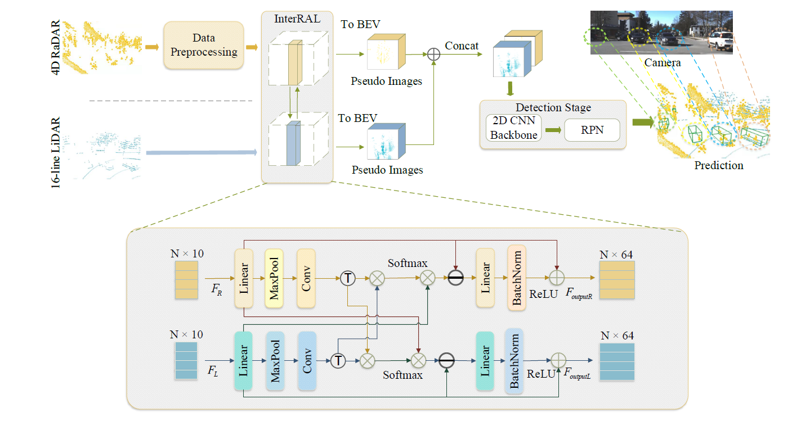
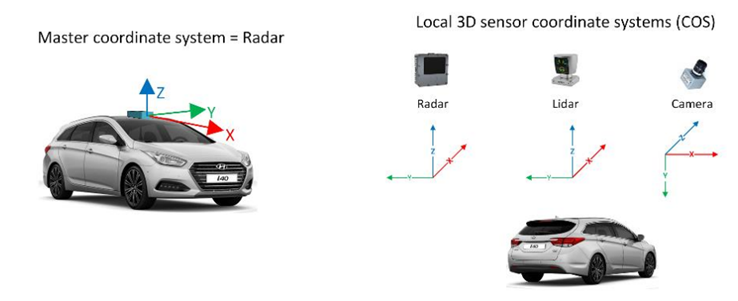
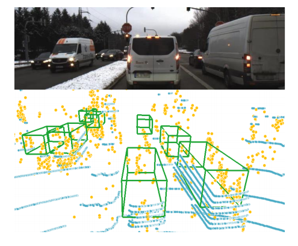

# InterFusion
This is a repo of [InterFusion](https://scholar.google.com/) for 3D object detection.

The code is mainly based on [OpenPCDet](https://github.com/open-mmlab/OpenPCDet).
<!-- 

 -->

## 项目用途
Many recent works detect 3D objects by several
sensor modalities for autonomous driving, where high-resolution
cameras and high-line Lidars are mostly used but relatively
expensive. To achieve a balance between overall cost and detection
accuracy, many multi-modal fusion techniques have been suggested.
In recent years, the fusion of Lidar and Radar has gained
ever-increasing attention, especially 4D Radar, which can adapt to
bad weather conditions due to its penetrability. Although features
have been fused from multiple sensing modalities, most methods
cannot learn interactions from different modalities, which does
not make for their best use. Inspired by the self-attention mechanism,
here we present InterFusion, an interaction-based fusion
framework, to fuse 16-line Lidar with 4D Radar. It aggregates
features from two modalities and identifies cross-modal relations
between Radar and Lidar features. In experimental evaluations
on the Astyx HiRes2019 dataset, our method outperformed the
baseline by 4.09% mAP in 3D and 10.34% BEV mAP for
the car class at the moderate level. 
* Model Framework:
<p align="center">
  
</p>

## 项目数据集
### 项目数据集简介

 Astyx HiRes2019数据集是一个流行的汽车雷达数据集，用于基于深度学习的3D对象检测。开源该数据集的动机是为研究社区提供高分辨率的雷达数据，
 促进和激励使用雷达传感器数据的算法的研究。该数据集是以雷达为中心的自动数据集，基于雷达、激光雷达和摄像机数据，用于三维目标检测。
 数据集的大小超过350 MB，由546帧组成，包含大约3000个非常精确标记的三维对象注释。虽然大多数对象属于“汽车”类，但也提供了总共7个类别（公共汽车、汽车、自行车手、摩托车手、人、拖车、卡车）的少量地面真实数据。
<p align="center">
  
</p>

### 项目数据集地址
`/home/datasets_user/astyx`

### 项目中数据集地址的引用

tools\cfgs\dataset_configs\astyx_dataset.yaml line 2,12,26

tools\cfgs\astyx_models\pointpillar.yaml line 30


## 安装信息
### 环境
- Python 3.8
- PyTorch '1.10.2+cu113'
- CUDA 11.3
- GCC 7.5
- pcdet '0.5.2+8c6e889'

### 安装步骤

a. Clone this repository.
```shell
git clone https://github.com/adept-thu/InterFusion.git
```

b. Install the dependent libraries as follows:

* Install the dependent python libraries: 
```
pip install -r requirements.txt 
```
c. Generate dataloader
```
python -m pcdet.datasets.astyx.astyx_dataset create_astyx_infos tools/cfgs/dataset_configs/astyx_dataset.yaml
```

## Training
```
CUDA_VISIBLE_DEVICES=1 python train.py --cfg_file cfgs/astyx_models/pointpillar.yaml --tcp_port 25851 --extra_tag yourmodelname
```

## Testing
```
python test.py --cfg_file cfgs/astyx_models/pointpillar.yaml --batch_size 4 --ckpt ##astyx_models/pointpillar/debug/ckpt/checkpoint_epoch_80.pth
```
## 核心文件简介

```
├─docker
├─docs
├─pcdet
│  ├─datasets
│  │  ├─astyx
│  │  ├─augmentor
│  │  ├─kitti
│  │  │  └─kitti_object_eval_python
│  │  ├─nuscenes
│  │  └─processor
│  ├─models
│  │  ├─backbones_2d
│  │  │  └─map_to_bev
│  │  ├─backbones_3d
│  │  │  ├─pfe
│  │  │  └─vfe
│  │  ├─dense_heads
│  │  │  └─target_assigner
│  │  ├─detectors
│  │  ├─model_utils
│  │  └─roi_heads
│  │      └─target_assigner
│  ├─ops
│  │  ├─iou3d_nms
│  │  │  └─src
│  │  ├─pointnet2
│  │  │  ├─pointnet2_batch
│  │  │  │  └─src
│  │  │  └─pointnet2_stack
│  │  │      └─src
│  │  ├─roiaware_pool3d
│  │  │  └─src
│  │  └─roipoint_pool3d
│  │      └─src
│  └─utils
└─tools
    ├─cfgs
    │  ├─astyx_models
    │  ├─dataset_configs
    │  ├─kitti_models
    │  └─nuscenes_models
    ├─eval_utils
    ├─scripts
    ├─train_utils
    │  └─optimization
    └─visual_utils
```


## 训练测试

### 训练

```shell
cd tools/
```
```
CUDA_VISIBLE_DEVICES=1 python train.py --cfg_file cfgs/astyx_models/pointpillar.yaml --tcp_port 25851 --extra_tag yourmodelname
```

### 测试

```shell
cd tools/
```
```
python test.py --cfg_file cfgs/astyx_models/pointpillar.yaml --batch_size 4 --ckpt ##astyx_models/pointpillar/debug/ckpt/checkpoint_epoch_80.pth
```

## 可视化
<p align="center">
  
</p>


## 实验效果
* All experiments are tested on Astyx Hires2019
<table>
   <tr>
      <td>Modality </td>
      <td>3DmAP(%) </td>
      <td></td>
      <td></td>
      <td></td>
      <td>BEV mAP(%)</td>
      <td></td>
   </tr>
      <td>Radar</td>
   </tr>
   <tr>
      <td>     </td>
      <td>Easy </td>
      <td>Moderate</td>
      <td>Hard</td>
      <td>Easy </td>
      <td>Moderate</td>
      <td>Hard</td>
   </tr>
   <tr>
      <td>PointRCNN </td>
      <td>12.23</td>
      <td>9.1</td>
      <td>9.1</td>
      <td>14.95</td>
      <td>13.82</td>
      <td>13.89</td>
   </tr>
   <tr>
      <td>SECOND [20] </td>
      <td>24.11</td>
      <td>18.5</td>
      <td>17.77</td>
      <td>41.25</td>
      <td>30.58</td>
      <td>29.33</td>
   </tr>
   <tr>
      <td>PVRCNN [33]</td>
      <td>28.21</td>
      <td>22.29</td>
      <td>20.4</td>
      <td>46.62</td>
      <td>35.1</td>
      <td>33.67</td>
   </tr>
   <tr>
      <td>PointPillars [30] </td>
      <td>30.14</td>
      <td>24.06</td>
      <td>21.91</td>
      <td>45.66</td>
      <td>36.71</td>
      <td>35.3</td>
   </tr>
   <tr>
      <td>Lidar</td>
      <td></td>
      <td></td>
      <td></td>
      <td></td>
      <td></td>
      <td></td>
   </tr>
   <tr>
      <td>PointRCNN [23] </td>
      <td>30.67</td>
      <td>23.69</td>
      <td>23.03</td>
      <td>35.75</td>
      <td>28.13</td>
      <td>23.79</td>
   </tr>
   <tr>
      <td>SECOND [20] </td>
      <td>53.32</td>
      <td>44.1</td>
      <td>40.16</td>
      <td>57.26</td>
      <td>47.52</td>
      <td>45.4</td>
   </tr>
   <tr>
      <td>PVRCNN [33] </td>
      <td>54.93</td>
      <td>45.29</td>
      <td>41.4</td>
      <td>56.71</td>
      <td>47.55</td>
      <td>45.06</td>
   </tr>
   <tr>
      <td>PointPillars [30] </td>
      <td>53.02</td>
      <td>43.56</td>
      <td>41.72</td>
      <td>55.76</td>
      <td>45.81</td>
      <td>43.62</td>
   </tr>
   <tr>
      <td>Radar+Lidar Ours(InterFusion) </td>
      <td>59.04</td>
      <td>47.65</td>
      <td>46.47</td>
      <td>68.1</td>
      <td>56.15</td>
      <td>55.01</td>
   </tr>
   <tr>
      <td>Delta </td>
      <td>+6.02 </td>
      <td>+4.09</td>
      <td>+4.75 </td>
      <td>+12.34</td>
      <td> +10.34</td>
      <td> +11.39</td>
   </tr>
</table>


## 目前成果 
-- 后续补充
| Dataset | benchmark | Params(M) | FLOPs(M) |               Download               |      Config      |
|:-------:|:---------:|:---------:|:--------:|:------------------------------------:|:----------------:|
|  KITTI  |           |           |          | [model](https:) &#124; [log](https:) | [config](https:) |
|         |           |           |          | [model](https:) &#124; [log](https:) | [config](https:) |

## 注意事项 


##引用

##作者联系方式（qq微信）
