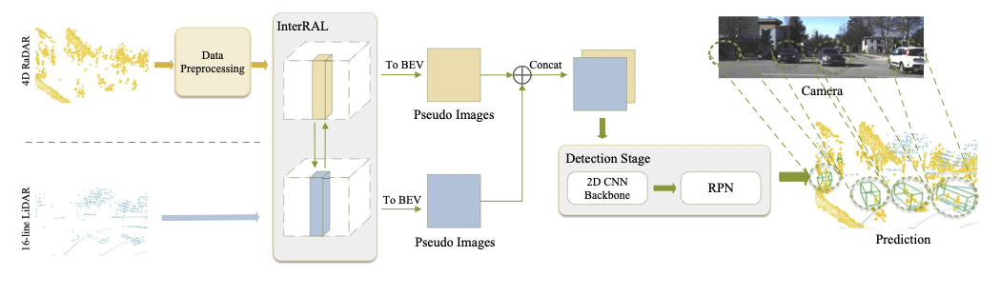

# InterFusion
Implementation for [InterFusin](https://scholar.google.com/) based on [OpenPCDet](https://github.com/open-mmlab/OpenPCDet)
<!-- 

 -->

## Introduction
* Model Framework:
<p align="center">
  
</p>

## Experiment Results:
* All experiments are tested on Astyx Hires2019


## Citation 
If you find this project useful in your research, please consider cite:


```

```

